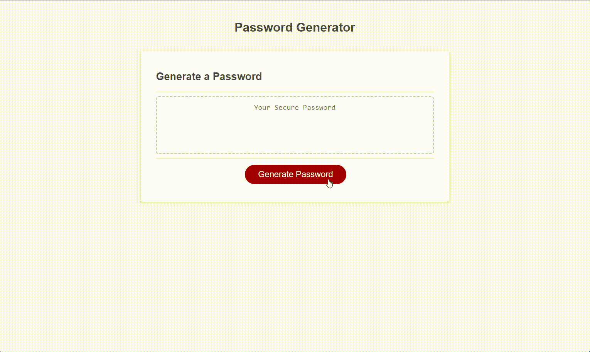

# Password-Generator
This is a random password generated that I made. It creates passwords based on user-selected criteria. It requires  minimum of 8 characters and allows for up to 128 characters to be used. 

## Live Project
https://executorkarthan.github.io/Password-Generator/

## Description
This is a tool used to develop randomized passwords for the user. This project helped me understand how to elicit user responses from a HTML webpage, how that data is then linked from the HTML input to variables in the javascript file, as well as how to call functions from the javascript file through the HTML page. I also came to understand the reverse of the above process: how to call functions in javascript and return their outputs to the HTML file. This project required me to understand how to test to see if two different characters match, considering type tests were not effective at discriminating between special characters and letters (upper or lower case). This project also uses randomization in several stages to ensure passwords are produced with higher security in mind.  

## Installation and Running
There is no installation for this project. The code will run in the web browser and does not take long (a few seconds post prompt) to devise a password. 

## How to Use this Project
To use this generator, you need to click the "Generate Password" button to begin. Then you need to enter how many characters long you would like your password to be. You must enter a value larger than seven but smaller than one hundred twenty eight. You need to select at least one type of character in your randomly generated password, but can choose up to four possible types. These character types are: uppercase letters, lowercase letters, digits, or one of the following special characters: !"#$%&'()*+,-./:;<=>?@[\]^_`{|}~. Once these selections are made, a new password will be generated according to the specifications set down.

## Credits
The majority of this code was authored by me, however I did use starter code from the following repository:
https://github.com/coding-boot-camp/friendly-parakeet

## License
This project has an MIT license